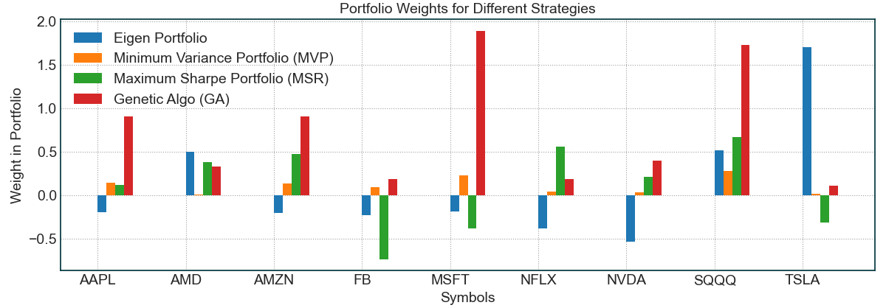

<p align="center">
  
</p>

# Eiten - Algorithmic Investing Strategies for Everyone
Eiten is an open source toolkit by [Tradytics](https://www.tradytics.com/) that implements various statistical and algorithmic investing strategies such as Eigen Portfolios, Minimum Variance Portfolios, Maximum Sharpe Portfolios, and Genetic Algorithms based Portfolios.

### Files Description
| Path | Description
| :--- | :----------
| eiten | Main folder.
| &boxur;&nbsp; figures | Figures for this github repositories.
| &boxur;&nbsp; stocks | Folder to keep your stock lists that you want to use to create your portfolios.
| &boxur;&nbsp; strategies | A bunch if strategies implemented in python.
| backtester.py | Backtesting module that both backtests and forward tests all portfolios.
| data_loader.py | Module for loading data from yahoo finance.
| portfolio_manager.py | Main file that takes in a bunch of arguments and generates several portfolios for you.
| simulator.py | Simulator that uses historical returns and monte carlo to simulate future prices for the portfolios.
| strategy_manager.py | Manages the strategies implemented in the 'strategies' folder.

## Usage
### Packages
You will need to install the following package to train and test the models.
- [Scikit-learn](https://scikit-learn.org/)
- [Numpy](https://numpy.org/)
- [Tqdm](https://github.com/tqdm/tqdm)
- [Yfinance](https://github.com/ranaroussi/yfinance)
- [Pandas](https://pandas.pydata.org/)
- [Scipy](https://www.scipy.org/install.html)

You can install all packages using the following command. Please note that the script was written using python3.

```
pip install -r requirements.txt
```

### Build your portfolios
Let us see how we can use all the strategies given in the toolkit to build our portfolios. The first thing you need to do is modify the **stocks.txt** file in the **stocks** folder and add the stocks of your choice. It is recommended to keep the list small i.e anywhere between **5 to 50** stocks should be fine. We have already put a small stocks list containing a bunch of tech stocks like AAPL, MSFT, TSLA etc. Let us build our portfolios now. This is the main command that you need to run.

```
python portfolio_manager.py --is_test 1 --future_bars 90 --data_granularity_minutes 3600 --history_to_use all --apply_noise_filtering 1 --market_index QQQ --only_long 1 --eigen_portfolio_number 3 --stocks_file_path stocks/stocks.txt
```

This command will use last 5 years of daily data excluding the last 90 days and build several portfolios for you. Based on those portfolios, it will then test them on the out of sample data of 90 days and show you the performance of each portfolio. Finally, it will also compare the performance with your choice of market index which is **QQQ** here. Let's dive into each of the parameters in detail.
- **is_test**: The value determined if the program is going to keep some separate data for future testing. When this is enabled, the value of **future_bars** should be larger than 5.
- **future_bars**: These are the bars that the tool will exclude during portfolio building and will forward test the portfolios on the excluded set. This is also called out of sample data.
- **data_granularity_minutes**: How much granular data do you want to use to build your portfolios. For long term portfolios, you should use daily data but for short term, you can use hourly or minute level data. The possible values here are **3600, 60, 30, 15, 5, 1.** 3600 means daily.
- **history_to_use**: Whether to use a specific number of historical bars or use everything that we receive from yahoo finance. For minute level data, we only receive upto one month of historical data. For daily, we receive 5 years worth of historical data. If you want to use all available data, the value should be **all** but if you want to use smaller history, you can set it to an integer value e.g **100** which will only use the last 100 bars to build the portfolios.
- **apply_noise_filtering**: This uses [random matrix theory](http://faculty.baruch.cuny.edu/jgatheral/randommatrixcovariance2008.pdf) to filter out the covariance matrix from randomness thus yielding better portfolios. A value of 1 will enable it and 0 will disable it.
- **market_index**: Which index do you want to use to compare your portfoliosl. This should mostly be **SPY** but since we analyzed tech stocks, we used **QQQ**.
- **only_long**: Whether to use long only portfolio or enable short selling as well. Long only portfolios have shown to have better performance using algorithmic techniques.
- **eigen_portfolio_number**: Which eigen portfolio to use. Any value between 1-5 should work. The first eigen portfolio (1) represents the market portfolio and should act just like the underlying index such as SPY or QQQ. The second one is orthogonal and uncorrelated to the market and poses the greatest risk and reward. The following ones have reduced risk and reward. Read more on [eigen-portfolios](https://srome.github.io/Eigenvesting-I-Linear-Algebra-Can-Help-You-Choose-Your-Stock-Portfolio/).
- **stocks_file_path**: File that contains the list of stocks that you want to use to build your portfolio.

### Portfolio Strategies
Four different portfolio strategies are currently supported by the toolkit.
1. **Eigen Portfolios**
	1. These portfolios are orthogonal and uncorrelated to the market in general thus yielding high reward and alpha. However, since they are uncorrelated to the market, they can also provide great risk. The first eigen portfolio is considered to be a market portfolio which is often ignored. The second one is uncorrelated to the others and provides the highest risk and reward. As we go down the numbering, the risk as well as the reward are reduced.
2. **Minimum Variance Portfolio (MVP)**
	1. MVP tries to minimize the variance of the portfolio. These portfolios are lowest risk and reward.
3. **Maximum Sharpe Ratio Portfolio (MSR)**
	1. MSR solves an optimization problem that tries to maximizes the sharpe ratio of the portfolio. It uses past returns during the optimization process which means if past returns are not the same as future returns, the results can vary in future.
4. **Genetic Algorithm based Portfolio**
	1. This is our own implementation of a GA based portfolio that again tries to maximize the sharpe ratio but in a slightly more robust way. This usually provides more robust portfolios than the others.

When you run the command above, our tool will generate portfolios from all these strategies and give them to you. Let us look at some resulting portfolios.

### Resulting Portfolios
For the purpose these results, we will use the 9 stocks in the stocks/stocks.txt file. When we run the above command, we first get the portfolio weights for all four strategies.

<p align="center">
  
</p>